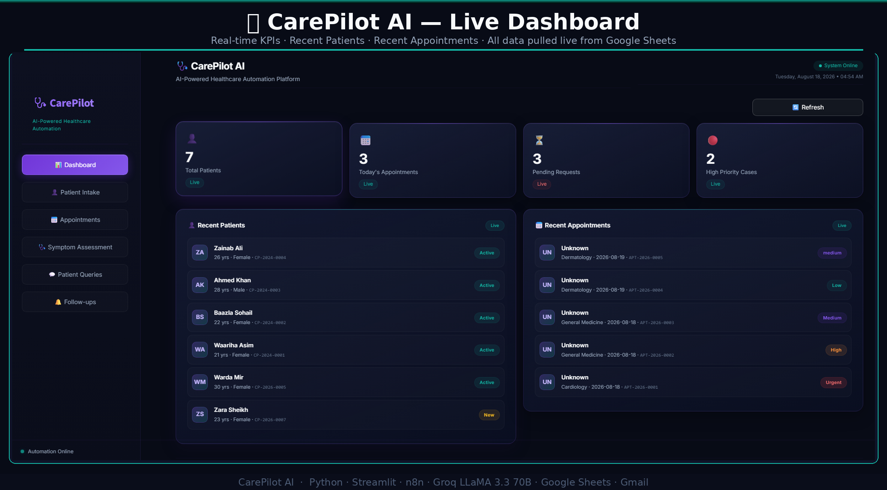
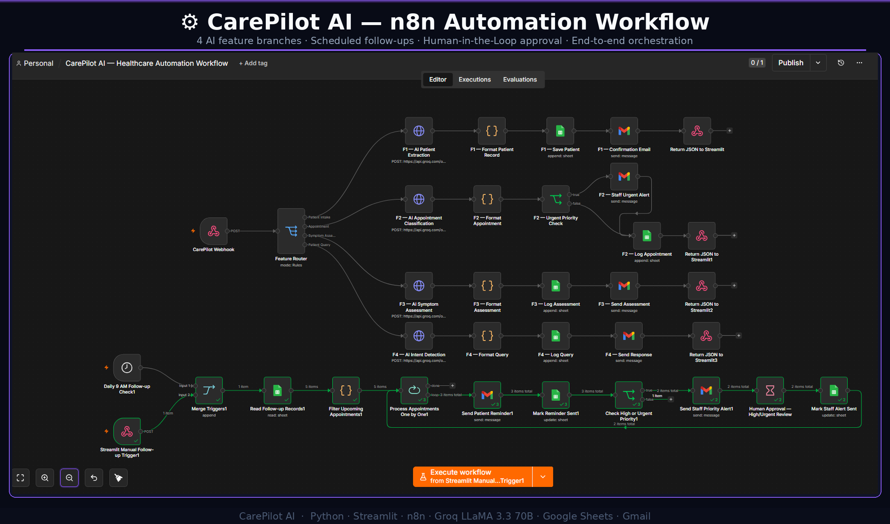
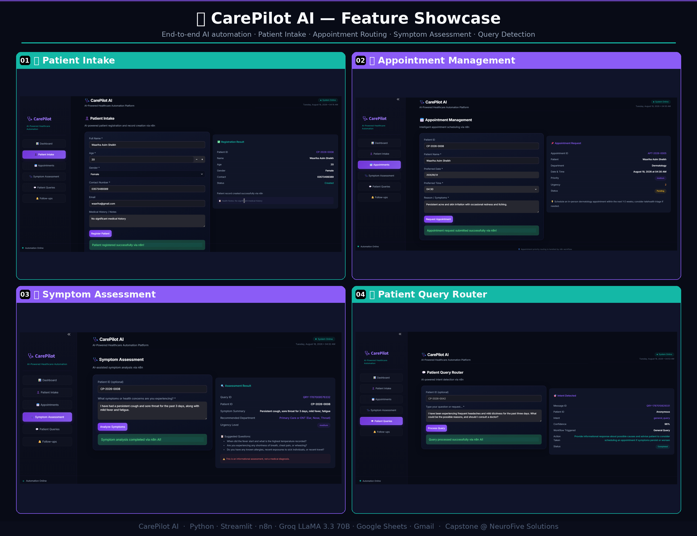
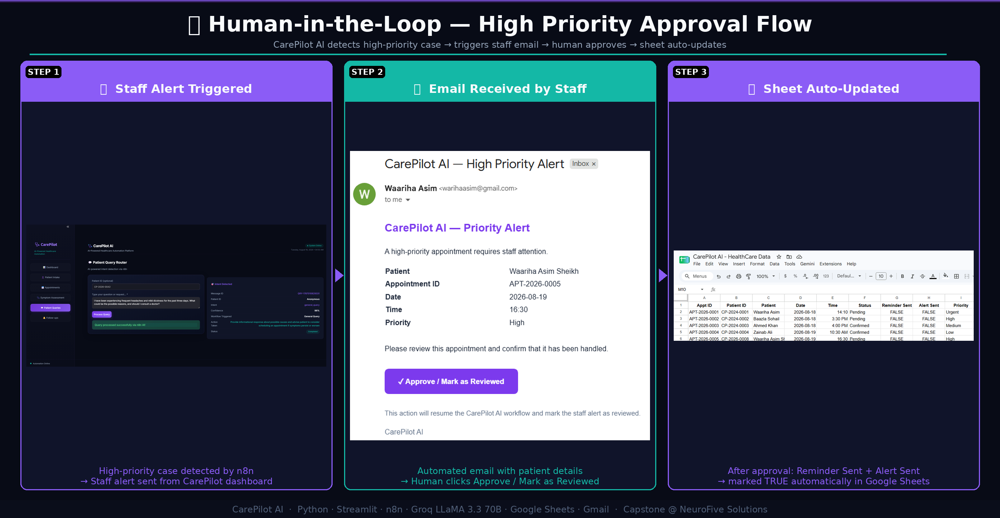

# 🩺 CarePilot AI

### AI-Powered Healthcare Workflow Automation Platform

> **Patient walks in. AI registers, routes, assesses, and alerts automatically.**

CarePilot AI is an end-to-end healthcare workflow automation platform that combines a **Streamlit interface**, **n8n workflow automation**, **LLM-powered processing**, **Google Sheets**, and **Gmail** into a connected operational system.

The goal was to go beyond a simple chatbot or isolated automation workflow and build a complete system with a user-facing interface, structured data management, automated workflows, monitoring, and human oversight for critical actions.

---

## 📸 Project Showcase

### Dashboard & Automation

| Streamlit Dashboard | n8n Automation Workflow |
|:---:|:---:|
|  |  |

### Features & Human-in-the-Loop

| Core Features | Human-in-the-Loop |
|:---:|:---:|
|  |  |

---

## 🚀 Key Features

- 👤 **AI-Powered Patient Intake**  
  Extracts and structures patient information and creates patient records.

- 📅 **Intelligent Appointment Routing**  
  Classifies department and priority and handles appointment records automatically.

- 🩺 **AI Symptom Assessment**  
  Processes reported symptoms and recommends the appropriate department.

- 💬 **Patient Query Routing**  
  Detects query intent and routes requests through the appropriate workflow.

- 🔔 **Automated Follow-Ups**  
  Processes upcoming appointments, sends reminders, and identifies cases requiring attention.

- 🚨 **Automated Staff Alerts**  
  High-priority cases can trigger automated notifications to staff.

- 🔐 **Human-in-the-Loop Approval**  
  Critical workflows can pause and require human approval before continuing.

- 📊 **Live Streamlit Dashboard**  
  Displays patient, appointment, and workflow information using data from Google Sheets.

---

## 🔐 Human-in-the-Loop

One of the core design decisions in CarePilot AI is that **AI does not have unrestricted control over critical actions**.

For high or urgent priority cases:

1. The workflow detects the priority level.
2. n8n pauses the workflow.
3. Staff receives an approval/review request.
4. Human approval resumes the workflow.
5. The relevant record is updated automatically.

This creates a balance between **automation speed and human control**.

> **AI handles the workflow. Humans stay in control of critical decisions.**

---

## 🏗️ System Architecture

```
Streamlit Dashboard
        ↓
    HTTP Webhook
        ↓
       n8n
        ↓
   Feature Router
        ↓
 ┌──────┼────────┬──────────┐
 ↓      ↓        ↓          ↓
F1     F2       F3         F4
Patient Appointment Symptom Query
Intake  Routing   Assessment Router
 ↓       ↓         ↓          ↓
 └──────────── AI Processing ─┘
             ↓
       Google Sheets
             ↓
        Gmail Alerts
             ↓
      Streamlit Dashboard
```
---

## 🔄 Follow-up Automation

Follow-up automation runs through scheduled/manual execution and can trigger reminders, staff alerts, and human approval when required.

---

## 🛠️ Tech Stack

| Layer | Technology |
|-------|------------|
| Frontend / UI | Python, Streamlit |
| Automation | n8n |
| AI / LLM | Groq API, LLaMA 3.3 70B |
| Data Layer | Google Sheets |
| Communication | Gmail |
| Integration | REST APIs, Webhooks, JSON |
| Data Processing | Pandas |

---

## 📁 Project Structure
CarePilot-AI-HealthCare-Automation-Platform/
│
├── app.py
├── workflow.json
├── project_outputs/
│ ├── dashboard_single.png
│ ├── features_collage_v2.png
│ ├── hitl_collage_v2.png
│ └── n8n_single.png
│
└── README.md

### Files

- `app.py` — Streamlit application and UI
- `workflow.json` — n8n automation workflow
- `project_outputs/` — Project screenshots and visual documentation

---

## ⚙️ Setup

### 1. Clone the Repository

```
git clone https://github.com/Waariha-Asim/CarePilot-AI-HealthCare-Automation-Platform.git
cd CarePilot-AI-HealthCare-Automation-Platform

---

## 2. Install Dependencies
bash
pip install streamlit pandas requests
Or, if a requirements.txt is added:


pip install -r requirements.txt

---

## 3. Set Up n8n
Run n8n locally:
n8n
Import workflow.json into your n8n instance.

The current application configuration uses local webhook endpoints:

N8N_WEBHOOK_URL = "http://localhost:5678/webhook-test/carepilot-ai"
N8N_FOLLOWUP_URL = "http://localhost:5678/webhook-test/carepilot-followups"
If n8n is running on another machine or hosted environment, replace these values with your own n8n webhook URLs.

Important: The localhost URLs work only when the Streamlit application can reach the same n8n instance. For a deployed Streamlit application, the n8n webhooks must be publicly reachable or otherwise accessible from the deployment environment.

---

## 4. Configure Google Sheets & Credentials
The application uses Google Sheets as its structured data layer.

Configure your own Google Sheets credentials and update the spreadsheet configuration as required.

The repository does not include the Google Sheet itself.

---

## 5. Run Streamlit
bash
streamlit run app.py

---
```

## 🌐 Deployment
The Streamlit dashboard can be deployed independently using a platform such as Streamlit Community Cloud.

Important
The dashboard UI can be deployed, but the form-based workflows depend on the n8n webhooks.

For the deployed version:

Streamlit Cloud
      ↓
Public n8n Webhook
      ↓
n8n Workflow
      ↓
Google Sheets / Gmail / Groq
Therefore, replace the local http://localhost:5678/... webhook URLs with your publicly accessible n8n webhook URLs before expecting the deployed forms to trigger the automation workflows.

---

## 📊 Dashboard
The dashboard provides a centralized view of the system, including:

Total patients

Today's appointments

Pending requests

High-priority cases

Recent patient records

Recent appointments

Workflow activity

Manual data refresh

Data is pulled from Google Sheets to keep the dashboard connected to the underlying workflow data.

---

## ⚠️ Disclaimer
CarePilot AI is an automation and workflow management project, not a medical diagnostic system.

It does not replace qualified healthcare professionals, provide medical diagnoses, or prescribe treatment. AI-generated information should be reviewed by appropriate healthcare personnel before making clinical decisions.

---

## 🔗 Repository
GitHub:
https://github.com/Waariha-Asim/CarePilot-AI-HealthCare-Automation-Platform

---

## 👩‍💻 Author
Waariha Asim
AI Engineer | Generative AI | AI Automation Engineer
